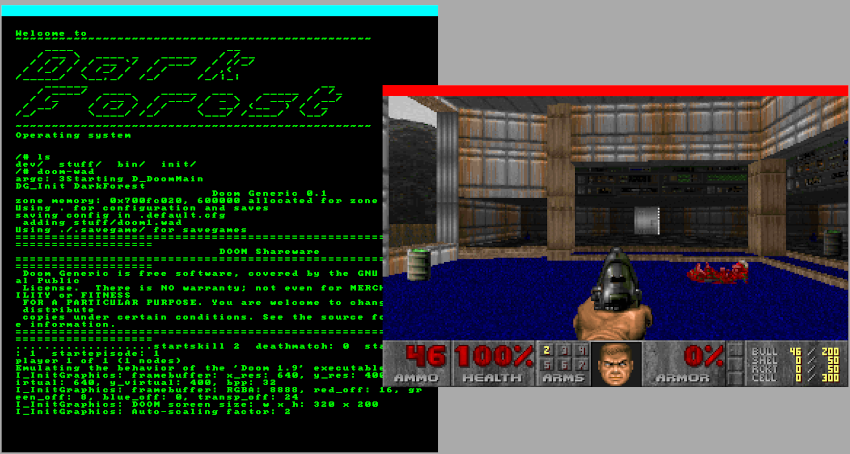

# DarkForest Operating System

A work in progress x86 operating system

Screenshot:



## Current features

- Preemptive Multiprocessing
- Basic round-robin scheduler
- Virtual Memory management
- Heap memory management
- Interrupts
- Keyboard driver
- Partial elf parser
- Userspace
- ATA Disk driver
- Fat32 (missing some features)
- userspace shell (cd, ls, cat, touch, mkdir)
- shared memory
- Graphical Window Server

## Build prerequisites

### On Debian
```bash
apt-get install gcc g++ make curl libmpc-dev nasm qemu-system-i386 dosfstools
```

### On Windows
Firstly get the scoop package manager which can be found on Github, or manually install the following packages
```batch
scoop install nasm qemu msys2 
```

Then run msys2 and update pacman, then
```bash
pacman -S gcc make texinfo mpc-devel diffutils python3 dosfstools
```
If you used scoop in the first step you should also add the scoop shims to your path so you can access your scoop packages from msys2 bash

## Build toolchain
```bash
cd toolchain
./build.sh full
```

## Build DarkForest
```bash
export LOCATION_OF_DARKFOREST_REPO=$HOME/DarkForest # change this to where you have placed the repo
export PATH="$LOCATION_OF_DARKFOREST_REPO/toolchain/cross/bin:$PATH"

# create filesystem image
fs_scripts/fs_setup.sh # needs root/administrator priv to mount fs

make

# copy files to filesystem image
./fs.sh # root/administrator priv
```

## Run
```bash
./run.sh
```

## Doom
There's a port of [doomgeneric](https://github.com/ozkl/doomgeneric).
To build the port:
```bash
cd doom/
./build.sh
# Download a WAD file (you can download the shareware version, `doom1.wad`) and put it in `doom/doomgeneric/doomgeneric`.
# sync file system image
./fs.sh
# Boot the system and type doom-wad in the terminal
# Play Doom :)
```


I take a lot of inspiration from Andreas Kling's amazing [SerenityOS](https://github.com/SerenityOS/serenity) - check it out!


